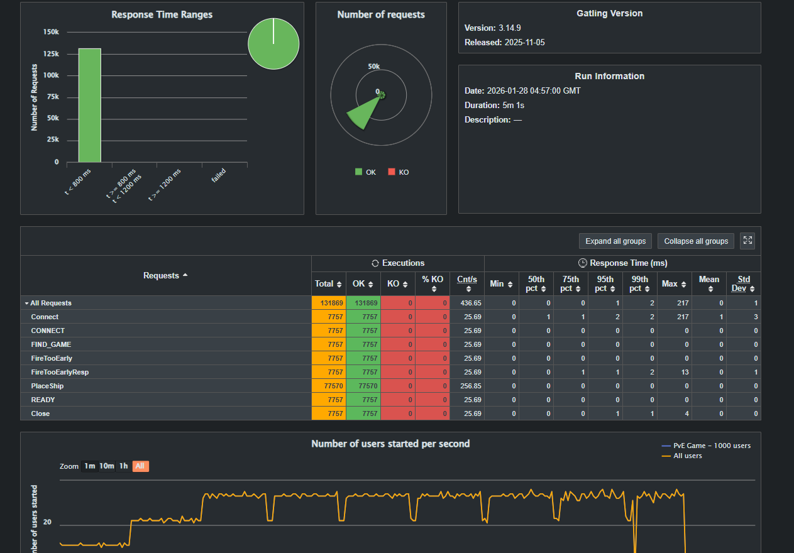
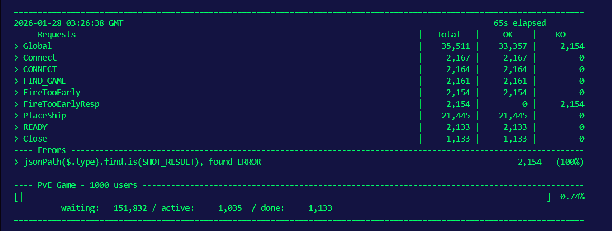

# Battleship Game — асинхронный WebSocket-сервер «Морской бой»

Проект реализует игру «Морской бой» с **асинхронным WebSocket-сервером на Netty**, **консольным клиентом** и двумя режимами **PvP против другого игрока** и **PvE против AI**.
Также есть модуль **нагрузочного тестирования (Gatling)** для проверки производительности и стабильности протокола.

Стек: Java 23 + Maven + Netty (WebSocket) + Jackson + SLF4J/Logback + Gatling (Scala)

## Модули проекта
- `battleship-common` — модели игры и JSON-протокол сообщений
- `battleship-server` — сервер (WebSocket endpoint `/game`)
- `battleship-client` — консольный клиент (интерактивная игра)
- `battleship-ai` — AI агент с алгоритмом Hunt/Target
- `battleship-loadtest` — Gatling сценарий нагрузки (1000 одновременных PvE игр)
- `doc/` — артефакты и скриншоты (см. раздел «Скриншоты»)

## Быстрый старт

### 1) Сборка
Из корня репозитория:
```bash
mvn -q clean package
```

### 2) Запуск сервера

**Windows (для корректного отображения кириллицы в логах):**
```powershell
[Console]::OutputEncoding = [System.Text.Encoding]::UTF8
chcp 65001
java -jar battleship-server/target/battleship-server-standalone.jar
```
По умолчанию: `ws://localhost:8080/game`.

### 3) Запуск клиента
```bash
java -jar battleship-client/target/battleship-client-standalone.jar localhost 8080
```

## Как играть (клиент)

1) При запуске введите имя игрока.
2) В меню выберите:
   - `1` — PvP (поиск соперника)
   - `2` — PvE (против AI)
3) Расстановка кораблей:
   - **Enter** — авторасстановка
   - `manual` — ручная расстановка
4) Формат координат:
   - для выстрела/размещения: `A0`, `B5`, `J9`
   - ориентация корабля: `H` (horizontal) / `V` (vertical)
   - в `H` ориентации будет расположен слева направо, в `V` сверху вниз
   - для однопалубных кораблей ориентация не требуется

### Отображение игры

После каждого выстрела показываются:
- **Сводка выстрела** (чей выстрел, координаты, результат)
- **Обе доски рядом**: ваша доска (слева) и доска противника (справа)

**Символы на доске:**
- `·` — пустая клетка
- `■` — ваш корабль (виден только на вашей доске)
- `o` — промах
- `x` — попадание
- `#` — потопленный корабль

**Особенности:**
- Когда корабль потоплен, все его клетки меняются с `x` на `#`
- После каждого хода видны результаты и вашего выстрела, и выстрела противника
- Игра автоматически завершается когда последний корабль уничтожен или если кто-то покинул матч раньше его завершения

## Протокол WebSocket (кратко)

Подключение к `ws://<host>:<port>/game`, обмен JSON-сообщениями.

### Клиент → Сервер
- `CONNECT` — подключение (имя игрока, версия)
- `FIND_GAME` — поиск игры (`PVP` / `PVE`)
- `PLACE_SHIP` — установка корабля
- `READY` — готовность начать
- `FIRE` — выстрел
- `SURRENDER` — сдаться

### Сервер → Клиент
- `CONNECTED` — подтверждение подключения
- `GAME_FOUND` — игра найдена (gameId, соперник)
- `SHIP_PLACED` — результат установки корабля
- `GAME_START` — старт игры (чья очередь)
- `SHOT_RESULT` — результат выстрела
- `GAME_OVER` — завершение игры
- `ERROR` — ошибка протокола/логики

Пример сообщений:
```json
{"type":"CONNECT","playerName":"Alice","clientVersion":"1.0.0"}
```
```json
{"type":"FIND_GAME","gameMode":"PVE","aiDifficulty":"MEDIUM"}
```
```json
{"type":"FIRE","x":0,"y":5}
```

## AI (PvE)

AI реализует улучшенную стратегию **Hunt/Target** с интеллектуальным анализом доски.

### Алгоритм работы

**Hunt-режим (поиск):**
- Стреляет по «шахматному» паттерну (клетки где x+y чётное)
- Это позволяет найти любой корабль минимум за 50 выстрелов на поле 10×10
- Если шахматка исчерпана — переходит на оставшиеся клетки

**Target-режим (добивание):**
1. **Группировка попаданий**: AI группирует все активные попадания (HIT) по 4-связности — каждая группа представляет один подбитый корабль
2. **Определение направления**: Для группы из 2+ попаданий определяет ориентацию (горизонтальная или вертикальная)
3. **Стрельба вдоль линии**: Стреляет строго по концам определённой линии (слева/справа для горизонтали, сверху/снизу для вертикали)
4. **Fallback**: Если оба конца заблокированы — пробует все 4 направления от каждого хита группы

### Оптимизации и ограничения

**Исключает потопленные корабли**: Не стреляет во все 8 клеток вокруг потопленного корабля (включая диагонали), т.к. корабли не могут касаться

**Исключает диагонали от попаданий**: Не стреляет по диагоналям от любых HIT-клеток, т.к. корабли располагаются только горизонтально или вертикально

**Корректная обработка границ**: Проверяет границы поля перед созданием координат, избегая исключений

**Фокус на добивании**: Не переключается на hunt-режим пока есть активные попадания

## Нагрузочное тестирование (Gatling)

Сценарий проверяет что сервер выдерживает **1000 одновременных WebSocket соединений** (PvE-игры с AI).

### Как запустить тест

**Шаг 1:** Запустите сервер (в отдельном терминале):
```bash
cd battleship-server
mvn exec:java -Dexec.mainClass="com.battleship.server.BattleshipServer"
```

**Шаг 2:** Запустите Gatling тест (в новом терминале, не останавливая сервер):
```bash
cd battleship-loadtest
mvn gatling:test
```

### Что происходит во время теста

Gatling запустит 1000 виртуальных игроков:
- **0-90 секунд**: Плавный разгон от 0 до 1000 одновременных пользователей
- **90-270 секунд**: Удержание 1000 активных соединений (плато нагрузки)
- **Максимальная длительность**: 3 минуты

Каждый игрок:

1. Подключается к `ws://localhost:8080/game`
2. Отправляет `CONNECT` с уникальным именем (Player_1, Player_2, ...)
3. Отправляет `FIND_GAME` с режимом PVE (против AI)
4. Пытается сделать FireTooEarly, получает ошибку - это правильное поведение, покажется как OK
4. Расставляет 10 кораблей (детерминированно по userId)
5. Отправляет `READY`
6. Ждет 30 секунд пока AI играет (AI стреляет автоматически)
7. Закрывает соединение

### Логи сервера

Во время теста в логах сервера будет:
```
[INFO] AIService - Создан AI игрок AI-XXX с уровнем MEDIUM
[INFO] GameEngine - Игра началась: [gameId]
[INFO] AIService - AI AI-XXX выстрелил в A5
[INFO] GameEngine - Игра завершена: [gameId], победитель: [playerId]
```

Каждые 30 секунд выводится статистика:
```
[INFO] BattleshipServer - Статистика: 1000 сессий, 1000 активных игр, 0 в очереди
```

## Остановка
- Сервер/клиент: `Ctrl+C`
- При остановке клиента во время игры автоматически отправляется `SURRENDER` (если соединение активно).
- Противник получает уведомление о победе через сообщение `GAME_OVER`.

## Скриншоты


*Отчёт Gatling: успешные ~1000 одновременных PvE игроков.*


*Проверка: ранний FIRE до READY даёт ожидаемый ответ если не сделать проверку .is("ERROR")*
